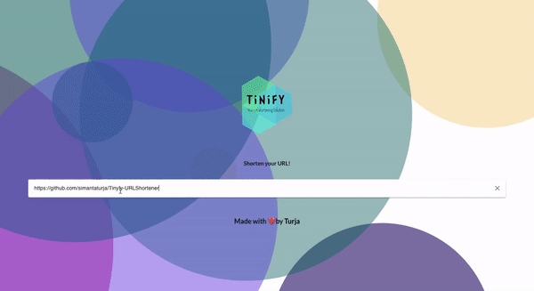

# Tinyfy - A free URL shortener


A free url shortener developed using Mongo, Express, React and Node (MERN stack). This app is currently running a beta version.

Visit https://tiinify.herokuapp.com/


## Screenshots / Demo


## Technologies used
<img src="https://img.icons8.com/color/452/mongodb.png" width="100px" height="100px") 


## Installation
```

    1. git clone https://github.com/simantaturja/Tinyfy-URLShortener.git
    2. cd Tinyfy-URLShortener
    3. Create your own .env for MONGOLAB_URI (Ex. MONGOLAB_URI=YOUR-MONGO-API-KEY_)
    4. npm install

    
```